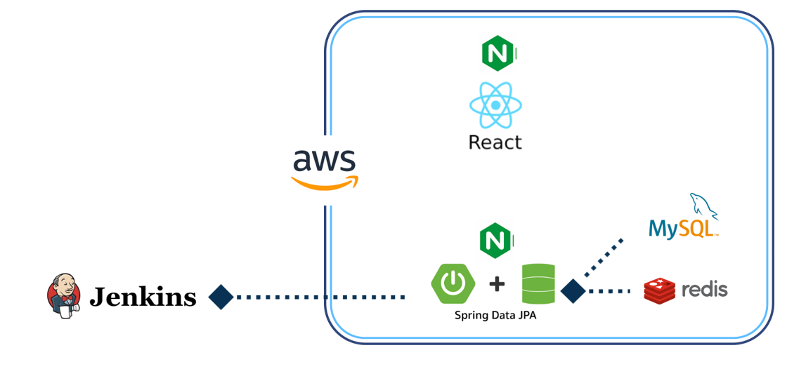
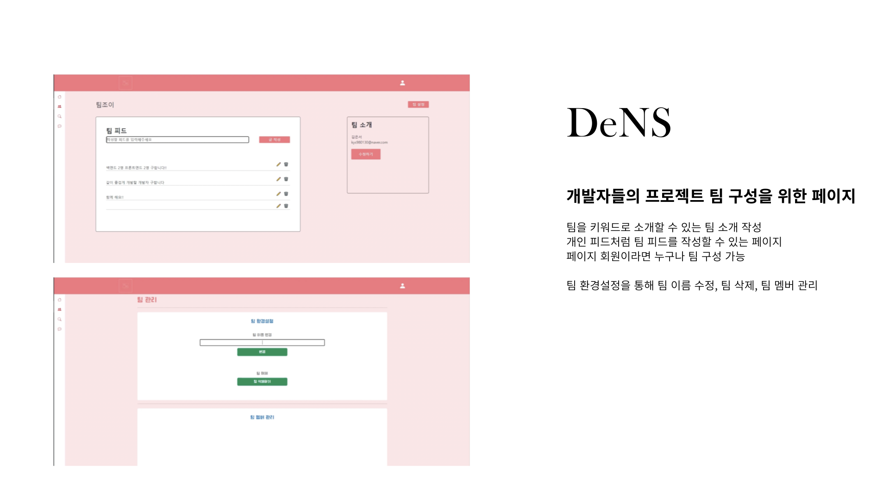
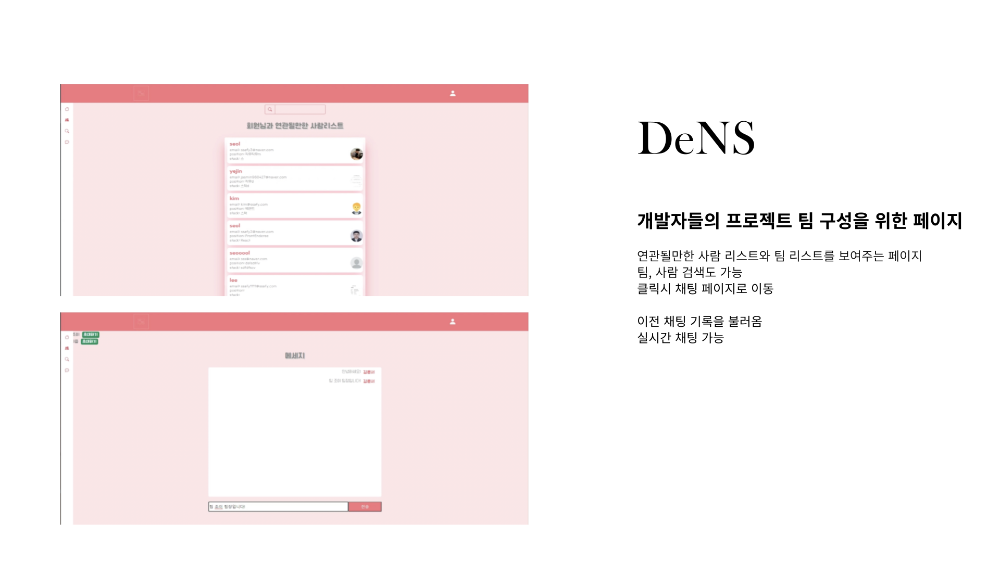

# DeNS

> 개발자 팀 구성을 위한 사이트

1. 일정 : 2021.01.10 - 2021.02.18 (총 7주)

2. 인원 (총 6인)

   - 윤설 : 팀장, Frontend
   - 김은서 : Backend
   - 김준우 : Backend
   - 김형준 : Frontend
   - 서예진 : Backend
   - 이승규 : Frontend

3. 기술 스택

   - Frontend : React
   - Backend : Spring, Java, Redis
   - Infra : Jenkins
   - DB : MySQL

4. 아키텍처

   

5. 주요 기능

   

​	

​	