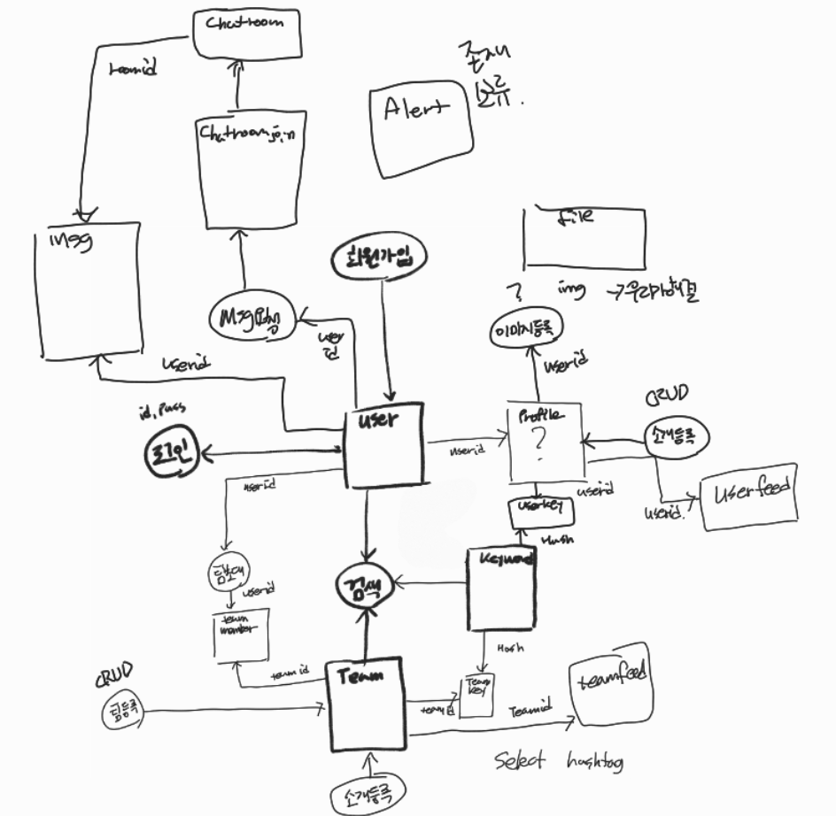

# README

[toc]

### 1/10 (월)

<hr>

- 명세서 기반 todo list 작성

- ERD 작성


  - 다대다 관계 중개테이블 생성

    - Team과 User 중개 테이블 : TeamMember
  - 프로필 따로 설계하여 중개테이블로 활용
  - follow-user 이중으로 연결하여 following, follower 설정

  

### 1/11 (화)

<hr>

- 프로젝트 기획 및 설계

  - 주제

    : 특정 소속의 팀 구성을 위한 SNS 서비스(ex, 학교, 싸피, 팀프로젝트)

  - 개요

    : **어느 조직**에 소속한 사람들이 프로젝트를 진행하기전 팀 or 스터디 팀원을 구성할 때 다른 외부 매체를 통해 연락을 주고 받음. 표준화된 매체가 없어 상대방과의 커뮤니케이션이 부족함을 인지함.

  - 설명

    - 각종 목적에 맞는 팀 구성을 위한 조직 표준화 SNS/커뮤니티를 개발.

    - 서버를 관리하는 관리자를 통해서 채널을 참가할 수 있음.

    - 사용자는 해당 채널에서 팀 구성을 원활하게 할 수 있음.

    - URL을 통해서 소속에 참가하게 되면 팀을 구성할수있게됨.

    - 소속 > 팀(ZOI) > 개인

    - 배경을 변경할수있다 테마 같은 느낌

      → UI쪽에서 다시 의논하기로

    - 팀 카드를 클릭시 팀에 대한 정보가 표시된다.(팀원 정보 표시)

    - 사람 카드를 클릭시 사람에 대한 정보가 표시된다. (관련 팀원들도 표시됨)

    - 채팅, 프로필에 중점을 둬야한다.

    - 개인정보는 이름 이메일 비밀번호 이상으론 없음.

    - 웹을 기본으로 생각하고 진행

### 1/12 (수)

<hr>

- NoSQL 스터디

- ERD 수정 및 보완

  - 관계형 DB

    

  - NoSQL

    

### 1/13 (목)

<hr>

- 기능에 따라 필요한 필드 작성
  - 회원관리
    - 회원가입
      - userid
      - email
      - username
      - password
      - admin(status)
    - 로그인
      - userid
      - password
  - 검색
    - 검색 내용
      - team_name
      - user_name
      - hashtag
  - 프로필
    - about
      - content
      - user_id
      - hashtag
    - image
      - image_id
      - image_name
    - skill
      - skill_name
      - skill_id
      - level
  - 메세지
    - 메세지
      - message_id
      - content
      - time
      - date
      - type
      - user_id
    - 팀 요청
      - user_id
      - type
      - team_id
      - time
      - date
      - request_id
  - 팀관리
    - 팀만들기
      - team_id
      - team_name
    - 팀 피드
      - title
      - content
      - regist_date
      - update_date
      - file
    - 팀 설정
      - team_id
      - team_name
      - team_intro
      - team_hashtag
      - team_icon(img)
      - user_id
      - user_name
    - 팀 멤버 관리
      - team_id
      - user_id
      - user_name
      - position
      - 
  - 알림
    - 알림연결
      - message_id
      - alert_id
      - type
    - 알림내용
      - content
      - time
- 테이블 관계 작성
  - 

### 1/14 (금)

<hr>


### 1/17 (월)

<hr>

- MySQL 설치
- ERD 수정

- 구현회의

  - 비회원(로그인X)

    - 회원가입
      - 이메일 입력
        - 이메일 중복 체크
        - 이메일 형식 체크
        - 이메일 인증
      - 이름
        - 4자 ~ 10자 사이(미정)
      - 비밀번호
        - 비밀번호 재확인
        - 숫자, 문자, 특수문자 각 1개씩 포함 8~16자 사이(미정)
    - 로그인
      - 아이디 입력
      - 비밀번호 입력
      - 아이디 / 비밀번호 체크
        - 성공 시 로그인
        - 실패 시 경고 알림

  - 회원(로그인O)

    - 회원 수정
      - 이름 수정
      - 비밀번호수정
      - 이메일 수정
    - 회원 탈퇴
      - 회원 탈퇴 버튼을 누른다
      - 진짜 탈퇴할 건지 경고 메세지를 출력한다
      - 확인을 누르면 회원 삭제
      - 취소를 누르면 유지
    - 마이페이지
      - 회원의 정보를 확인할 수 있다.

    채널 관리자 페이지(일반 유저가 채널관리자가 될 때, 권한 부임 & 기능 등 생각)

### 1/18 (화)

<hr>

- 회원가입 1차 코드

  ```java
  @PostMapping("/signup")
  @ResponseBody
  public String signup(@Valid User newUser) {
  
      String email = newUser.getEmail();
      String password = newUser.getPassword();
      String name = newUser.getName();
      int identity = newUser.getIdentity();
  
      User user = new User();
      user.setEmail(email);
      user.setPassword(password);
      user.setName(name);
      user.setIdentity(identity);
  
      userService.signup(user);
  
      return "success";
  }
  ```

  ```java
  @Service
  @RequiredArgsConstructor
  public class UserService {
  
      private final UserRepository userRepository;
  
      public String signup(User user){
          validateDuplicateUser(user);
          userRepository.save(user);
          return user.getEmail();
      }
  
      private void validateDuplicateUser(User user) {
          List<User> findUsers = userRepository.findByEmail(user.getEmail());
          if (!findUsers.isEmpty()) {
              throw new IllegalStateException("이미 존재하는 회원입니다.");
          }
      }
  }
  ```

- 회원가입 2차 코드

  ```java
  package com.ssafy.TeamZOI.service;
  
  import com.ssafy.TeamZOI.entity.Salt;
  import com.ssafy.TeamZOI.entity.User;
  import com.ssafy.TeamZOI.repository.UserRepository;
  import lombok.RequiredArgsConstructor;
  import lombok.extern.slf4j.Slf4j;
  import org.springframework.beans.factory.annotation.Autowired;
  import org.springframework.stereotype.Service;
  import org.springframework.transaction.annotation.Transactional;
  
  import java.util.List;
  
  @Service
  public class AuthServiceImpl implements AuthService{
  
      @Autowired
      private UserRepository userRepository;
  
      @Autowired
      private SaltUtil saltUtil;
  
      @Override
      @Transactional(rollbackFor = Exception.class)
      public void signUp(User user) {
          String password = user.getPassword();
          String salt = saltUtil.genSalt();
          user.setSalt(new Salt(salt));
          user.setPassword(saltUtil.encodePassword(salt, password));
          validateDuplicateUser(user);
          userRepository.save(user);
          System.out.println(userRepository.findByEmail(user.getEmail()));
          System.out.println(user.getPassword());
          System.out.println(user.getEmail());
          System.out.println(salt);
      }
  
      private void validateDuplicateUser(User user) {
          List<User> findUsers = userRepository.findByEmail(user.getEmail());
          if (!findUsers.isEmpty()) {
              throw new IllegalStateException("이미 존재하는 회원입니다.");
          }
      }
  
  }
  ```

  ```java
  @PostMapping("/signup")
      public Response signUp(User user) {
          Response response = new Response();
  
          try {
              authService.signUp(user);
              response.setResponse("success");
              response.setMessage("회원가입을 성공적으로 완료했습니다.");
              response.setData(null);
          }
          catch(Exception e) {
              response.setResponse("failed");
              response.setMessage("회원가입을 하는 도중 오류가 발생했습니다.");
              response.setData(e.toString());
          }
          return response;
      }
  ```

  

### 1/19 (수)

<hr>

- 비밀번호 변경 기능 구현

  ```java
  @Override
      public void changePassword(User user, String password) throws NotFoundException {
          if(user==null) throw new NotFoundException("changePassword(), 멤버가 조회되지 않습니다.");
          String salt = saltUtil.genSalt();
          user.setSalt(new Salt(salt));
          user.setPassword(saltUtil.encodePassword(salt, password));
          userRepository.save(user);
  
      }
  @Override
      public boolean isPasswordUuidValidate(String key) {
          return false;
      }
  ```

  ```java
  @PostMapping(value = "/password")
      public Response requestChangePassword(RequestChangePassword1 requestChangePassword1) {
          Response response = new Response();
          try {
              User user = authService.findByEmail(requestChangePassword1.getEmail());
              if (!user.getEmail().equals(requestChangePassword1.getEmail())) throw new NoSuchFieldException("");
              authService.requestChangePassword(user);
              response.setResponse("success");
              response.setMessage("성공적으로 사용자의 비밀번호를 변경했습니다.");
              response.setData(null);
          } catch (NoSuchFieldException e) {
              response.setResponse("error");
              response.setMessage("사용자의 정보를 조회할 수 없습니다.");
              response.setData(null);
          } catch (Exception e) {
              response.setResponse("error");
              response.setMessage("비밀번호 변경 요청을 할 수 없습니다.");
              response.setData(null);
          }
          return response;
      }
  
      @PutMapping("/password")
      public Response changePassword(RequestChangePassword2 requestChangePassword2) {
          Response response = new Response();
          HttpStatus status;
          try {
              User user = authService.findByEmail(requestChangePassword2.getEmail());
              authService.changePassword(user, requestChangePassword2.getPassword());
              response.setResponse("success");
              response.setMessage("사용자의 비밀번호를 성공적으로 변경했습니다.");
              response.setData(null);
          } catch (Exception e) {
              response.setResponse("error");
              response.setMessage("사용자의 비밀번호를 변경할 수 없습니다.");
              response.setData(null);
          }
          return response;
      }
  ```


### 1/20 (목)

<hr>

- 비밀번호 변경 요청 메일 보내기

  ```java
  @GetMapping("/password/{key}")
      public Response isPasswordUUIDValidate(@PathVariable String key) {
          Response response = new Response();
          try {
              if (authService.isPasswordUuidValidate(key)) {
                  response.setResponse("success");
                  response.setMessage("정상적인 접근입니다.");
                  response.setData(null);
              }
              else {
                  response.setResponse("error");
                  response.setMessage("유효하지 않은 key값입니다.");
                  response.setData(null);
              }
          } catch (Exception e) {
              response.setResponse("error");
              response.setMessage("유효하지 않은 key값입니다.");
              response.setData(null);
          }
          return response;
      }
  
      @PostMapping(value = "/password")
      public Response requestChangePassword(RequestChangePassword1 requestChangePassword1) {
          Response response = new Response();
          try {
              User user = authService.findByEmail(requestChangePassword1.getEmail());
              if (!user.getEmail().equals(requestChangePassword1.getEmail())) throw new NoSuchFieldException("");
              authService.requestChangePassword(user);
              response.setResponse("success");
              response.setMessage("성공적으로 사용자의 비밀번호를 변경요청을 수행했습니다.");
              response.setData(null);
          } catch (NoSuchFieldException e) {
              response.setResponse("error");
              response.setMessage("사용자의 정보를 조회할 수 없습니다.");
              response.setData(null);
          } catch (Exception e) {
              response.setResponse("error");
              response.setMessage("비밀번호 변경 요청을 할 수 없습니다.");
              response.setData(null);
          }
          return response;
      }
  ```

  ```java
  @Override
      public void requestChangePassword(User user) throws NotFoundException {
          String CHANGE_PASSWORD_LINK = "http://localhost:8080/password/";
          if(user == null) throw new NotFoundException("멤버가 조회되지 않습니다.");
          String key = REDIS_CHANGE_PASSWORD_PREFIX+ UUID.randomUUID();
          redisUtil.setDataExpire(key, user.getName(), 60*30L);
          emailService.sendMail(user.getEmail(), "사용자 비밀번호 안내 메일", CHANGE_PASSWORD_LINK+key);
      }
  
      @Override
      public boolean isPasswordUuidValidate(String key) {
          String userId = redisUtil.getData(key);
          return !userId.equals("");
      }
  ```


### 1/21 (금)

<hr>

- 프로필 생성 회원가입에 추가

  ```java
   @Override
      @Transactional(rollbackFor = Exception.class)
      public void signUp(User user) {
          String password = user.getPassword();
          String salt = saltUtil.genSalt();
          user.setSalt(new Salt(salt));
          user.setPassword(saltUtil.encodePassword(salt, password));
          validateDuplicateUser(user);
  
          Profile profile = new Profile();
          profile.setName(user.getName());
          profile.setEmail(user.getEmail());
          profile.setJob(null);
          profile.setStack(null);
          user.setProfile(profile);
          userRepository.save(user);
      }
  ```

- 프로필 조회

  ```java
  @Override
      public Optional<Profile> findProfile(RequestModifyProfile1 requestModifyProfile1) throws NotFoundException{
          List<User> findUsers = userRepository.findByEmail(requestModifyProfile1.getEmail());
          if (findUsers.isEmpty()) throw new NotFoundException("회원이 조회되지 않습니다.");
          User findUser = findUsers.get(0);
          String hashedPassword = findUser.getPassword();
          SaltUtil.checkPassword(hashedPassword, requestModifyProfile1.getPassword());
          Optional<Profile> findProfile = profileRepository.findByName(findUser.getName());
          return findProfile;
      }
  ```

  ```java
  @GetMapping
  @ApiOperation(value = "유저 프로필 조회")
  public Response findProfile(RequestModifyProfile1 requestModifyProfile1) {
      Response response = new Response();
      try {
          Optional<Profile> profile = profileService.findProfile(requestModifyProfile1);
          response.setResponse("success");
          response.setMessage("사용자의 프로필을 성공적으로 조회했습니다.");
          response.setData(null);
          return response;
      }
      catch (Exception e) {
          response.setResponse("error");
          response.setMessage("사용자의 프로필을 조회할 수 없습니다.");
          response.setData(null);
          return response;
      }
  }
  ```

- 프로필 수정

  ```java
  @Override
  public Profile modifyProfile(Profile findProfile, RequestModifyProfile2 requestModifyProfile2) throws NotFoundException {
  
      User user = userRepository.findByName(findProfile.getName());
      findProfile.setName(requestModifyProfile2.getName());
      user.setName(requestModifyProfile2.getName());
      user.setEmail(requestModifyProfile2.getEmail());
      findProfile.setJob(requestModifyProfile2.getJob());
      findProfile.setStack(requestModifyProfile2.getStack());
  
      profileRepository.save(findProfile);
  
      return findProfile;
  }
  ```

  ```java
  @PutMapping
  @ApiOperation(value = "유저 프로필 수정")
  public Response modifyProfile(RequestModifyProfile2 requestModifyProfile2) {
      Response response = new Response();
      try {
          List<User> findUsers = userRepository.findByEmail(requestModifyProfile2.getEmail());
          Profile findProfile = findUsers.get(0).getProfile();
          Profile newProfile = profileService.modifyProfile(findProfile, requestModifyProfile2);
          response.setResponse("success");
          response.setMessage("사용자의 프로필을 성공적으로 수정했습니다.");
          response.setData(null);
      }
      catch (Exception e) {
          response.setResponse("error");
          response.setMessage("사용자의 프로필을 조회할 수 없습니다.");
          response.setData(null);
      }
      return response;
  }
  ```


### 1/24 (월)

<hr>

- 이미지

  ```java
  package com.ssafy.BackEnd.entity;
  
  import lombok.*;
  
  import javax.persistence.*;
  
  @Entity
  @NoArgsConstructor(access = AccessLevel.PROTECTED)
  @Table(name = "image")
  @Getter @Setter
  
  public class Image {
  
      @Id @GeneratedValue
      Long image_id;
  
      @Column(nullable = false)
      String orig_image_name;
  
      @Column(nullable = false)
      String image_name;
  
      @Column(nullable = false)
      String savefolder;
  
      @Builder
      public Image(Long image_id, String orig_image_name, String image_name, String savefolder) {
          this.image_id = image_id;
          this.orig_image_name = orig_image_name;
          this.image_name = image_name;
          this.savefolder = savefolder;
      }
  
      public Image(String savefolder) {
          this.savefolder = savefolder;
      }
  }
  
  ```

  ```java
  package com.ssafy.BackEnd.service;
  
  import com.ssafy.BackEnd.dto.ImageDto;
  import com.ssafy.BackEnd.entity.Image;
  import com.ssafy.BackEnd.repository.ImageRepository;
  import org.springframework.stereotype.Service;
  
  import javax.transaction.Transactional;
  
  @Service
  public class ImageService {
  
      private ImageRepository imageRepository;
  
      public ImageService(ImageRepository imageRepository) {
          this.imageRepository = imageRepository;
      }
  
      @Transactional
      public Long saveImage(ImageDto imageDto) {
          return imageRepository.save(imageDto.toEntity()).getImage_id();
      }
  
      @Transactional
      public ImageDto getImage(Long image_id) {
          Image image = imageRepository.findById(image_id).get();
  
          ImageDto imageDto = ImageDto.builder()
                  .image_id(image_id)
                  .orig_image_name(image.getOrig_image_name())
                  .image_name(image.getImage_name())
                  .savefolder(image.getSavefolder())
                  .build();
          return imageDto;
      }
  }
  
  ```

  ```java
  @PostMapping("/image")
      public String uploadImage(@RequestParam("image") MultipartFile image) {
          try {
              String orig_image_name = image.getOriginalFilename();
              String image_name = new MD5Generator(orig_image_name).toString();
              String folder = System.getProperty("user.dir") + "\\image";
  
              if (!new File(folder).exists()) {
                  try {
                      new File(folder).mkdir();
                  }
                  catch(Exception e) {
                      e.getStackTrace();
                  }
              }
              String savefolder = folder + "\\" + image_name;
              image.transferTo(new File(savefolder));
  
              ImageDto imageDto = new ImageDto();
              imageDto.setOrig_image_name(orig_image_name);
              imageDto.setImage_name(image_name);
              imageDto.setSavefolder(savefolder);
  
              Long image_id = imageService.saveImage(imageDto);
  
          } catch (Exception e) {
              e.printStackTrace();
          }
          return "redirect:/";
      }
  ```


### 1/25 (화)

<hr>

- UserFeedFile

  ```java
    @PostMapping("/post")
      public String post(String email, @Validated @ModelAttribute UserFeedAddForm userFeedAddForm, BindingResult bindingResult) throws IOException, NotFoundException {
          if (bindingResult.hasErrors()) {
              log.info("bindingResult : {}", bindingResult.getFieldError());
              return "post";
          }
          Profile profile = profileService.findProfile(email).get();
          UserFeedDto userFeedDto = userFeedAddForm.createUserFeedDto(profile);
          UserFeed post = userFeedService.post(userFeedDto);
          return "redirect:/main/board" + post.getProfile();
      }
  
      @ResponseBody
      @GetMapping("/images/{filename}")
      public UrlResource processImg(@PathVariable String filename) throws MalformedURLException {
          return new UrlResource("file:" + fileStore.createPath(filename, FileType.IMAGE));
      }
  
      @GetMapping("/files/{filename}")
      public ResponseEntity<UrlResource> processFiles(@PathVariable String filename, @RequestParam String originName) throws MalformedURLException {
          UrlResource urlResource = new UrlResource("file:" + fileStore.createPath(filename, FileType.GENERAL));
          String encodedUploadFileName = UriUtils.encode(originName, StandardCharsets.UTF_8);
          String contentDisposition = "files; filename=\"" + encodedUploadFileName + "\"";
  
          return ResponseEntity.ok()
                  .header(HttpHeaders.CONTENT_DISPOSITION, contentDisposition)
                  .body(urlResource);
      }
  ```

  ```java
  package com.ssafy.BackEnd.dto;
  
  import com.ssafy.BackEnd.entity.FileType;
  import com.ssafy.BackEnd.entity.Profile;
  import com.ssafy.BackEnd.entity.UserFeed;
  import lombok.Builder;
  import lombok.Data;
  import lombok.NoArgsConstructor;
  import org.springframework.web.multipart.MultipartFile;
  
  import javax.validation.constraints.NotBlank;
  import java.util.ArrayList;
  import java.util.List;
  import java.util.Map;
  import java.util.concurrent.ConcurrentHashMap;
  
  @Data
  @NoArgsConstructor
  public class UserFeedDto {
  
      private Profile profile;
  
      @NotBlank
      private String content;
  
      private Map<FileType, List<MultipartFile>> userFeedFiles = new ConcurrentHashMap<>();
  
      @Builder
      public UserFeedDto(Profile profile, String content, Map<FileType, List<MultipartFile>> userFeedFiles) {
          this.profile = profile;
          this.content = content;
          this.userFeedFiles = userFeedFiles;
      }
  
      public UserFeed createUserFeed() {
          return UserFeed.builder()
                  .profile(profile)
                  .content(content)
                  .userFeedFiles(new ArrayList<>())
                  .build();
      }
  }
  
  ```

  ```java
  package com.ssafy.BackEnd.entity;
  
  import com.ssafy.BackEnd.dto.UserFeedDto;
  import lombok.Builder;
  import lombok.Data;
  import lombok.NoArgsConstructor;
  import org.springframework.web.multipart.MultipartFile;
  
  import javax.validation.constraints.NotBlank;
  import java.util.ArrayList;
  import java.util.List;
  import java.util.Map;
  import java.util.concurrent.ConcurrentHashMap;
  
  @Data
  @NoArgsConstructor
  public class UserFeedAddForm {
  
      @NotBlank
      private String content;
  
      private List<MultipartFile> imageFiles;
      private List<MultipartFile> generalFiles;
  
      @Builder
      private UserFeedAddForm(String content, List<MultipartFile> imageFiles, List<MultipartFile> generalFiles) {
          this.content = content;
          this.imageFiles = (imageFiles != null) ? imageFiles : new ArrayList<>();
          this.generalFiles = (generalFiles != null) ? generalFiles : new ArrayList<>();
      }
  
      public UserFeedDto createUserFeedDto(Profile profile) {
          Map<FileType, List<MultipartFile>> userFeedFiles = getFileTypeListMap();
          return UserFeedDto.builder()
                  .profile(profile)
                  .content(content)
                  .userFeedFiles(userFeedFiles)
                  .build();
      }
  
      private Map<FileType, List<MultipartFile>> getFileTypeListMap() {
          Map<FileType, List<MultipartFile>> userFeedFiles = new ConcurrentHashMap<>();
          userFeedFiles.put(FileType.IMAGE, imageFiles);
          userFeedFiles.put(FileType.GENERAL, generalFiles);
          return userFeedFiles;
      }
  }
  
  ```

  ```java
  package com.ssafy.BackEnd.entity;
  
  import lombok.*;
  
  import javax.persistence.*;
  
  @Entity
  @Table(name = "userfeedfile")
  @NoArgsConstructor(access = AccessLevel.PROTECTED)
  @SequenceGenerator(
          name = "File_SEQ_GENERATOR",
          sequenceName = "FILE_SEQ"
  )
  @Getter @Setter
  public class UserFeedFile {
  
      @Id
      @GeneratedValue(strategy = GenerationType.SEQUENCE)
      private long userfeedfile_id;
  
      private String originalFileName;
  
      private String fileName;
  
      @Enumerated(EnumType.STRING)
      private FileType fileType;
  
      @ManyToOne(fetch = FetchType.LAZY, cascade = CascadeType.ALL)
      @JoinColumn(name = "userfeed_id")
      UserFeed user_feed;
  
      @Builder
      public UserFeedFile(String originalFileName, String storePath, FileType fileType) {
          this.originalFileName = originalFileName;
          this.fileName = storePath;
          this.fileType = fileType;
      }
  }
  
  ```

  ```java
  package com.ssafy.BackEnd.service;
  
  import com.ssafy.BackEnd.entity.FileType;
  import com.ssafy.BackEnd.entity.UserFeedFile;
  import com.ssafy.BackEnd.repository.UserFeedFileRepository;
  import lombok.RequiredArgsConstructor;
  import org.springframework.stereotype.Service;
  import org.springframework.web.multipart.MultipartFile;
  
  import java.io.IOException;
  import java.util.List;
  import java.util.Map;
  import java.util.stream.Collectors;
  import java.util.stream.Stream;
  
  @Service
  @RequiredArgsConstructor
  public class UserFeedFileServiceImpl implements UserFeedFileService {
  
      private final UserFeedFileRepository userFeedFileRepository;
      private final FileStore fileStore;
  
      @Override
      public List<UserFeedFile> saveUserFeedFiles(Map<FileType, List<MultipartFile>> multipartFileListMap) throws IOException {
          List<UserFeedFile> imageFiles = fileStore.storeFiles(multipartFileListMap.get(FileType.IMAGE), FileType.IMAGE);
          List<UserFeedFile> generalFiles = fileStore.storeFiles(multipartFileListMap.get(FileType.GENERAL), FileType.GENERAL);
          List<UserFeedFile> result = Stream.of(imageFiles, generalFiles)
                  .flatMap(f -> f.stream())
                  .collect(Collectors.toList());
          return result;
      }
  
      @Override
      public Map<FileType, List<UserFeedFile>> findUserFeedFiles() {
          List<UserFeedFile> userFeedFiles = userFeedFileRepository.findAll();
          Map<FileType, List<UserFeedFile>> result = userFeedFiles.stream()
                  .collect(Collectors.groupingBy(UserFeedFile::getFileType));
          return result;
      }
  
      @Override
      public void save(UserFeedFile file) {
          userFeedFileRepository.save(file);
      }
  }
  
  ```


### 1/26 (수)

<hr>

- 프로필 기능 수정

  ```java
   @GetMapping("/{profile_id}")
      @ApiOperation(value = "유저 프로필 조회")
      public ResponseEntity<Profile> findProfile(@PathVariable Long profile_id) {
          Response response = new Response();
          try {
              Optional<Profile> profile = profileService.findById(profile_id);
              if (profile != null) {
                  return new ResponseEntity<Profile>(profile.get(),HttpStatus.OK);
              }
  //            response.setResponse("success");
  //            response.setMessage("사용자의 프로필을 성공적으로 조회했습니다.");
  //            response.setData(null);
              else {
                  return new ResponseEntity<Profile>((Profile) null, HttpStatus.NOT_FOUND);
              }
  
          }
          catch (Exception e) {
  //            response.setResponse("error");
  //            response.setMessage("사용자의 프로필을 조회할 수 없습니다.");
  //            response.setData(null);
              return new ResponseEntity<Profile>((Profile) null, HttpStatus.NOT_FOUND);
          }
      }
  
      @PutMapping("/{profile_id}")
      @ApiOperation(value = "유저 프로필 수정")
      public ResponseEntity<Profile> modifyProfile(@PathVariable Long profile_id, @RequestBody RequestModifyProfile2 requestModifyProfile2) {
          Response response = new Response();
          try {
  
              Profile findProfile = profileService.findById(profile_id).get();
              Profile newProfile = profileService.modifyProfile(findProfile, requestModifyProfile2);
  //            response.setResponse("success");
  //            response.setMessage("사용자의 프로필을 성공적으로 수정했습니다.");
  //            response.setData(null);
              return new ResponseEntity<Profile>(newProfile, HttpStatus.OK);
          }
          catch (Exception e) {
  //            response.setResponse("error");
  //            response.setMessage("사용자의 프로필을 조회할 수 없습니다.");
  //            response.setData(null);
              return new ResponseEntity<Profile>((Profile) null, HttpStatus.NOT_FOUND);
          }
      }
  
      @PostMapping("/update/image/{profile_id}")
      public ResponseEntity<String> updateImage(@PathVariable Long profile_id, MultipartFile multipartFile) throws NotFoundException {
          String imagePath = imageService.update(profile_id, multipartFile);
          return new ResponseEntity<String>(imagePath, HttpStatus.OK);
      }
  ```

- keyword 연관관계 수정

### 1/27 (목)

<hr>

- 팀 기능 오류 수정

- Custom Exception

  ```java
  public class CustomException extends RuntimeException {
  
      private ErrorCode errorCode;
  
      public CustomException(String message, ErrorCode errorCode) {
          super(message);
          this.errorCode = errorCode;
      }
  
      public CustomException(ErrorCode errorCode) {
          super(errorCode.getMessage());
          this.errorCode = errorCode;
      }
  
      public ErrorCode getErrorCode() {
          return this.errorCode;
      }
  ```

  ```java
  @Getter
  @RequiredArgsConstructor
  @JsonFormat(shape = JsonFormat.Shape.OBJECT)
  public enum ErrorCode implements EnumModel{
  
      INVALID_CODE(400, "C001", "Invalid Code"),
      RESOURCE_NOT_FOUND(204, "C002", "Resource not found"),
      EXPIRED_CODE(400, "C003", "Expired Code"),
      AWS_ERROR(400, "A001", "aws client error"),
      INTERNER_SERVER_ERROR(500, "A005", "interner server error");
  
      private int status;
      private String code;
      private String message;
      private String detail;
  
      ErrorCode(int status, String code, String message) {
          this.status = status;
          this.message = message;
          this.code = code;
      }
  
      @Override
      public String getKey() {
          return this.code;
      }
  
      @Override
      public String getValue() {
          return this.message;
      }
  
  }
  ```

  ```java
  @Getter @Setter
  public class ErrorResponse {
  
      private String message;
      private String code;
      private int status;
      private String detail;
  
      public ErrorResponse(ErrorCode code) {
          this.message = code.getMessage();
          this.status = code.getStatus();
          this.code = code.getCode();
          this.detail = code.getDetail();
      }
  }
  ```

  ```java
  @RestControllerAdvice
  @Slf4j
  public class GlobalExceptionHandler {
  
      @ExceptionHandler(value = Exception.class)
      @ResponseStatus(value = HttpStatus.BAD_REQUEST)
      protected ResponseEntity<ErrorResponse> handleException(Exception e) {
          ErrorResponse response = ErrorResponse.of(ErrorCode.EXPIRED_CODE);
          response.setDetail(e.getMessage());
          return new ResponseEntity<>(response, HttpStatus.BAD_REQUEST);
      }
  }
  ```

  ```java
  public interface EnumModel {
  
      String getKey();
      String getValue();
  }
  ```

  

  
