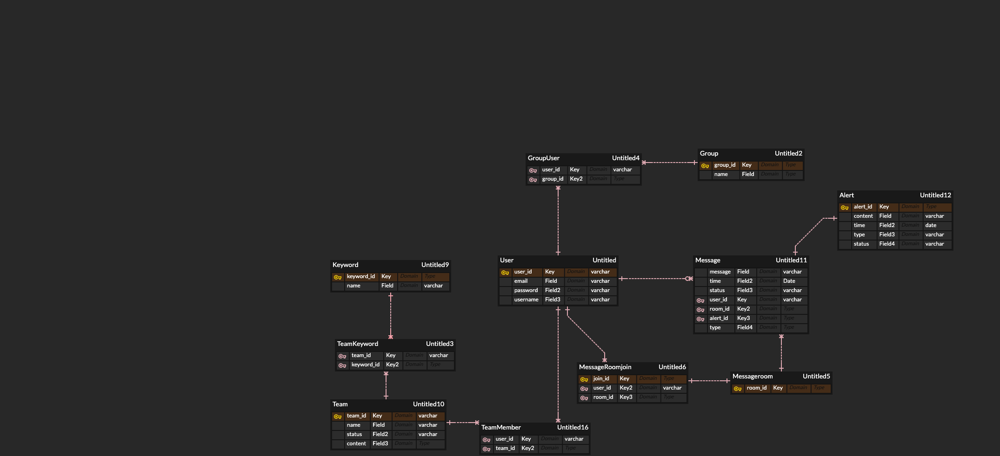
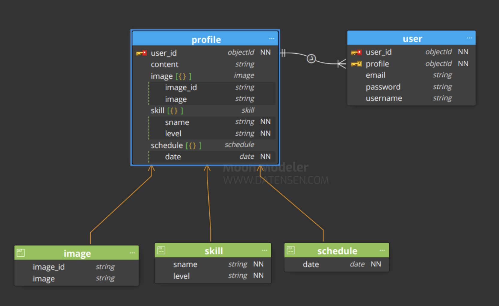

# README

[toc]

### 1/10 (월)

- 명세서 기반 todo list 작성

- ERD 작성

  - 다대다 관계 중개테이블 생성

    - Team과 User 중개 테이블 : TeamMember
  - 프로필 따로 설계하여 중개테이블로 활용
  - follow-user 이중으로 연결하여 following, follower 설정

  

### 1/11 (화)

- 프로젝트 기획 및 설계

  - 주제

    : 특정 소속의 팀 구성을 위한 SNS 서비스(ex, 학교, 싸피, 팀프로젝트)

  - 개요

    : **어느 조직**에 소속한 사람들이 프로젝트를 진행하기전 팀 or 스터디 팀원을 구성할 때 다른 외부 매체를 통해 연락을 주고 받음. 표준화된 매체가 없어 상대방과의 커뮤니케이션이 부족함을 인지함.

  - 설명

    - 각종 목적에 맞는 팀 구성을 위한 조직 표준화 SNS/커뮤니티를 개발.

    - 서버를 관리하는 관리자를 통해서 채널을 참가할 수 있음.

    - 사용자는 해당 채널에서 팀 구성을 원활하게 할 수 있음.

    - URL을 통해서 소속에 참가하게 되면 팀을 구성할수있게됨.

    - 소속 > 팀(ZOI) > 개인

    - 배경을 변경할수있다 테마 같은 느낌

      → UI쪽에서 다시 의논하기로

    - 팀 카드를 클릭시 팀에 대한 정보가 표시된다.(팀원 정보 표시)

    - 사람 카드를 클릭시 사람에 대한 정보가 표시된다. (관련 팀원들도 표시됨)

    - 채팅, 프로필에 중점을 둬야한다.

    - 개인정보는 이름 이메일 비밀번호 이상으론 없음.

    - 웹을 기본으로 생각하고 진행

### 1/12 (수)

- NoSQL 스터디

- ERD 수정 및 보완

  - 관계형 DB

    

  - NoSQL

    

### 1/13 (목)

- 기능에 따라 필요한 필드 작성
  - 회원관리
    - 회원가입
      - userid
      - email
      - username
      - password
      - admin(status)
    - 로그인
      - userid
      - password
  - 검색
    - 검색 내용
      - team_name
      - user_name
      - hashtag
  - 프로필
    - about
      - content
      - user_id
      - hashtag
    - image
      - image_id
      - image_name
    - skill
      - skill_name
      - skill_id
      - level
  - 메세지
    - 메세지
      - message_id
      - content
      - time
      - date
      - type
      - user_id
    - 팀 요청
      - user_id
      - type
      - team_id
      - time
      - date
      - request_id
  - 팀관리
    - 팀만들기
      - team_id
      - team_name
    - 팀 피드
      - title
      - content
      - regist_date
      - update_date
      - file
    - 팀 설정
      - team_id
      - team_name
      - team_intro
      - team_hashtag
      - team_icon(img)
      - user_id
      - user_name
    - 팀 멤버 관리
      - team_id
      - user_id
      - user_name
      - position
      - 
  - 알림
    - 알림연결
      - message_id
      - alert_id
      - type
    - 알림내용
      - content
      - time
- 테이블 관계 작성
  - 
