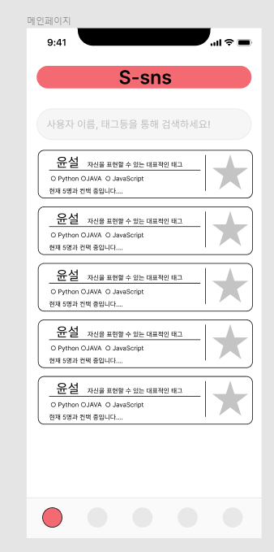
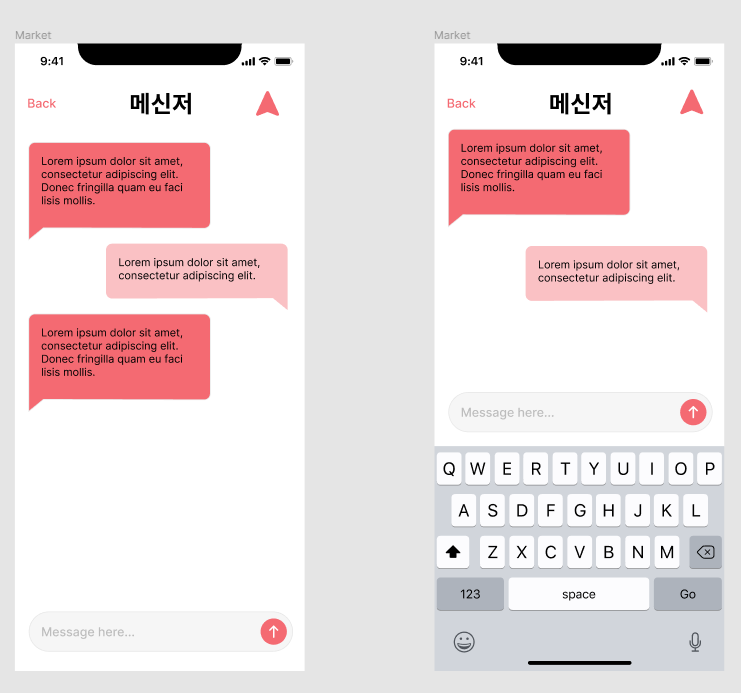

# README

### 0110 (월)

## 노션

공통 프로젝트의 전체적인 틀 구성. 프로젝트 진행에 도움되는 페이지 구성 및 규칙 정의

 
 

## 개요

페이지별 내용 UI 디자인 설계
  

## Figma란

웹 기반 인 벡터 그래픽 편집기 및 프로토타이핑 도구이며 macOS 및 Window 용 데스크톱 응용 프로그램에서 추가 오프라인 기능을 사용

 

## 결과물

 

 메인페이지   

 환경설정페이지   

 회원가입로그인 페이지   

 채팅 페이지   

# 0111 회의

### 주제
특정 소속의 팀 구성을 위한 SNS서비스 (학교, 싸피, 팀프로젝트, 동아리)

### 개요
**어느 조직**에 소속한 사람들이 프로젝트를 진행하기전 팀 or 스터디 팀원을 구성할 때 다른 외부 매체를 통해 연락을 주고 받음. 표준화된 매체가 없어 상대방과의 커뮤니케이션이 부족함을 인지함.

## 설명

각종 목적에 맞는 팀 구성을 위한 조직 표준화 SNS/커뮤니티를 개발. 

서버를 관리하는 관리자를 통해서 채널을 참가할 수 있음.

사용자는 해당 채널에서 팀 구성을 원활하게 할 수 있음.

URL을 통해서 소속에 참가하게 되면 팀을 구성할수있게됨.

소속 > 팀(ZOI) > 개인

배경을 변경할수있다 테마 같은 느낌

→ UI쪽에서 다시 의논하기로

팀 카드를 클릭시 팀에 대한 정보가 표시된다.(팀원 정보 표시)

사람 카드를 클릭시 사람에 대한 정보가 표시된다. (관련 팀원들도 표시됨)

채팅, 프로필에 중점을 둬야한다.

개인정보는 이름 이메일 비밀번호 이상으론 없음.

웹을 기본으로 생각하고 진행

